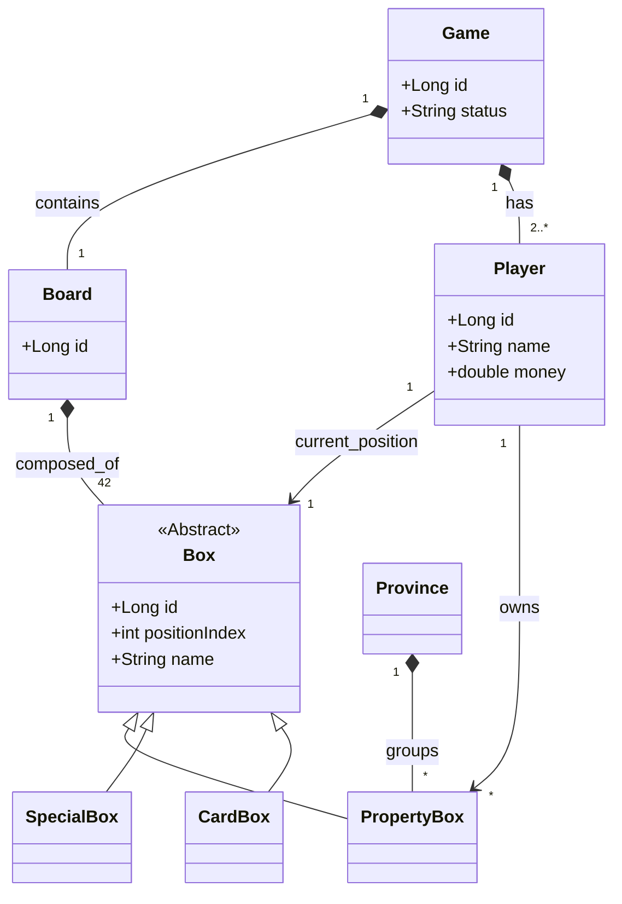

```mermaid
classDiagram
    %% Relaciones Generales
    Game "1" *-- "1" Board : contains
    Game "1" *-- "2..*" Player : has
    Board "1" *-- "42" Box : composed_of
    
    %% Herencia de Casillas (Boxes)
    Box <|-- PropertyBox
    Box <|-- SpecialBox
    Box <|-- CardBox

    %% Relación Jugador - Casilla
    Player "1" --> "1" Box : current_position
    Player "1" --> "*" PropertyBox : owns

    %% Agrupación de Propiedades (Provincias/Zonas)
    Province "1" *-- "*" PropertyBox : groups

    class Game {
        +Long id
        +String status
      
    }

    class Player {
        +Long id
        +String name
        +double money

    }

    class Board {
        +Long id
    }

    class Box {
        <<Abstract>>
        +Long id
        +int positionIndex
        +String name

    }

    class PropertyBox {

    }

    class SpecialBox {

    }

    class CardBox {

    }

    class Province {

    }
```

